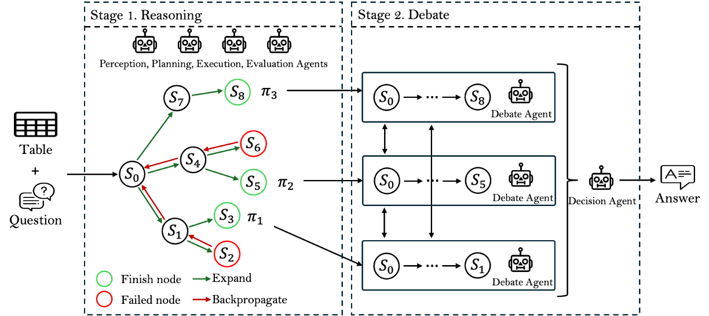

# Planning over Actions: Agentic Reasoning for Semi-Structured Table Question Answering

This repository provides the official method implementation of **TQA-Agent**, an agentic reasoning framework for semi-structured table question answering.

TQA-Agent reformulates semi-structured Table QA as a structured search problem over an explicit space of executable semantic actions. Instead of following a single linear reasoning chain, the framework explores multiple candidate reasoning paths via Monte Carlo Tree Search (MCTS), and selects the most reliable path through a multi-agent debate and decision mechanism.

The system decomposes complex table reasoning into interpretable and composable table-centric actions, and coordinates multiple specialized LLM-based agents for perception, planning, execution, evaluation, and decision-making. This design improves robustness, interpretability, and stability under complex table structures such as multi-level headers, merged cells, and heterogeneous regions.

## Method Overview

TQA-Agent addresses semi-structured table question answering by modeling the reasoning process as **agentic search over an explicit executable action space**. Instead of generating a single reasoning chain through prompting, the method constructs and evaluates multiple candidate reasoning trajectories and selects the most reliable one.

Given a table and a question, TQA-Agent builds a **reasoning tree** where each node represents a structured reasoning state (current table view, accumulated context, and resolved constraints). A complete root-to-leaf path forms a full reasoning trajectory.



As illustrated in the overview figure, the framework consists of two coordinated stages:

### Stage 1 — Action-Space Reasoning with MCTS

The first stage performs Monte Carlo Tree Search over the predefined table action space to generate multiple candidate reasoning paths. Each simulation step is driven by specialized agents:

- a **Perception Agent** summarizes the current reasoning context,
- a **Planning Agent** proposes the next executable action,
- an **Execution Agent** applies the action to update the reasoning state,
- an **Evaluation Agent** scores the new state for backpropagation.

Through iterative selection, expansion, simulation, and backpropagation, MCTS explores diverse reasoning branches and collects high-quality candidate paths instead of relying on a single trajectory.

### Stage 2 — Multi-Agent Debate and Decision

In the second stage, the candidate reasoning paths are evaluated at the trajectory level. Multiple **Debate Agents** independently assess and critique each path with respect to correctness, completeness, and evidential support. A **Decision Agent** then aggregates the debate outcomes and selects the most reliable reasoning path, from which the final answer is produced.

By combining action-level search with path-level debate and decision, TQA-Agent reduces path dependency and error accumulation, leading to more stable and interpretable table reasoning.

## Agent Roles

TQA-Agent instantiates multiple specialized agents that collaborate within the reasoning and selection stages.

### Perception Agent
Builds a structured abstraction of the current reasoning state, including table transformations, resolved constraints, and intermediate artifacts. It produces a compact context report for planning.

### Planning Agent
Selects the next executable action from the predefined action space based on the current context report, structural feasibility, and remaining question goals.

### Execution Agent
Applies the selected action to the reasoning state. It performs concrete table-centric operations such as row filtering, column selection, construction of derived attributes, and numerical computation.

### Evaluation Agent
Assigns a scalar score to each new reasoning state based on reasoning progress, structural consistency, and intermediate result validity. The score is used for MCTS back-propagation.

### Debate Agent
Operates at the path level after search. Each debate agent evaluates a complete reasoning trajectory, analyzes its strengths and weaknesses, and critiques alternative paths.

### Decision Agent
Aggregates debate results and selects the most reliable reasoning path according to global criteria such as completeness, consistency, and evidential support.

## Action Space

TQA-Agent defines an explicit action space consisting of executable semantic table operations. The actions are organized into six functional categories.

### Table Information Retrieval Actions
- HeaderParsing — flatten multi-level headers and complete implicit labels
- ColumnLocating — align question semantics with relevant columns
- RowLocating — filter rows based on question constraints

### Reasoning Actions
- ColumnConstructing — create derived columns for intermediate results
- RowConstructing — create derived rows for aggregated values
- RowSorting — sort rows by attribute
- Grouping — group rows by shared attributes

### Computation Action
- Computing — generate and execute arithmetic or logical formulas over table data (LLM-generated plan + deterministic execution)

### External Knowledge Retrieval Actions
- GeneralRetrieval — retrieve open-domain explanatory knowledge
- DomainSpecificRetrieval — retrieve domain knowledge for specialized indicators

### Question Decomposition Actions
- ParallelDecomposing — split into independent sub-questions
- SerialDecomposing — split into dependent sub-questions

### Termination Action
- Finish — terminate reasoning path and produce candidate answer

Each action produces explicit intermediate artifacts and is traceable in the reasoning path.

## Repository Structure

This repository contains the full implementation of the TQA-Agent framework, including the action-space definition, MCTS-based reasoning engine, multi-agent coordination modules, LLM adapters, and prompt templates. The directory structure is organized to align with the method design described in the paper.

```bash
tqa-agent/
├── core/                          # Core reasoning engine and search framework
│   ├── mcts.py                    # MCTS-based reasoning path search
│   ├── mcts_node.py               # MCTS node definition
│   ├── reasoning_context.py       # Reasoning state representation
│   ├── trace.py                   # Reasoning path and step trace structures
│   ├── schemas.py                 # Agent protocol interfaces
│   └── heuristics.py              # Search control heuristics
│
├── actions/                       # Executable table reasoning actions
│   ├── base.py                    # Action base class
│   ├── registry.py                # Action registration and builder
│   │
│   ├── table_structure/           # Header parsing and structure normalization
│   ├── locating/                  # Column/row locating actions
│   ├── reasoning/                 # Table transformation actions
│   ├── computing/                 # Computation actions (LLM plan + deterministic execution)
│   ├── retrieval/                 # External knowledge retrieval actions
│   ├── decomposition/             # Question decomposition actions
│   └── finish/                    # Termination action
│
├── agents/                        # Agent implementations (protocol-driven)
│   ├── mcts/                      # Stage-1 reasoning agents
│   │   ├── planning_agent.py      # Planning agent (action proposal)
│   │   ├── execution_agent.py     # Execution agent (action execution)
│   │   ├── evaluation_agent.py    # Evaluation agent (state scoring)
│   │   └── perception_agent.py    # Perception agent (state percepting)
│   │
│   ├── selection/                 # Stage-2 selection agents
│   │   ├── debate_agent.py        # Candidate path debate agent
│   │   └── decision_agent.py      # Final path decision agent
│   │
│   └── utils/
│       └── prompt_loader.py       # Prompt template loader
│
├── llm/                           # LLM abstraction and adapters
│   ├── client/                    # Model provider adapters (OpenAI / DeepSeek / etc.)
│   ├── json_utils.py              # Structured JSON output parsing & retry
│   └── errors.py                  # LLM error definitions
│
├── prompts/                       # Prompt templates for all agents
│   ├── mcts_planning.*            # Planning agent prompt
│   ├── mcts_evaluation.*          # Evaluation agent prompt
│   ├── mcts_perception.*          # Perception agent prompt
│   ├── mcts_execution.*           # Execution agent prompt
│   ├── selection_debate.*         # Debate agent prompt
│   ├── selection_decide.*         # Decision agent prompt
│   └── semantic_match.*           # Accuracy calculation prompt
│
├── figs/                          # Framework and method figures for documentation
│
├── config.py                      # Global configuration (model & search parameters)
├── main.py                        # End-to-end pipeline entry point
└── README.md                      # Repository documentation
```

## Configuration

Model provider, backbone model, and search parameters are configurable.

Supported backbone models include:

- GPT-4o
- DeepSeek-V3

Environment variables example:

```bash
export TQA_PROVIDER=openai
export TQA_MODEL=gpt-4o
export OPENAI_API_KEY=YOUR_KEY
```

or

```bash
export TQA_PROVIDER=deepseek
export TQA_MODEL=deepseek-v3
export DEEPSEEK_API_KEY=YOUR_KEY
```

Search-related parameters can be configured in `config.py`, including:

- number of MCTS iterations
- maximum candidate paths
- debate enable/disable

## Run

```bash
python main.py \
  --table table.txt \
  --question "What is the total amount of the planned unit cost and the actual unit cost?"
```